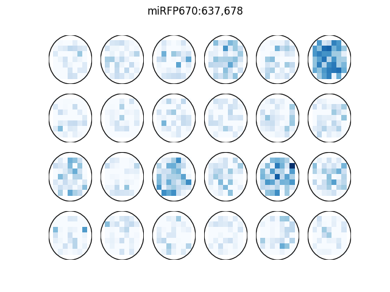

# PlateReader
#### Table of contents

  - [About](#about)
  - [Installation](#installation)
  - [Basic Usage](#basic-usage)
  - [Screenshots](#screenshots)
  - [Advanced Usage](#advanced-usage)

A tool to read and plot data from a [Cytation 5](https://www.biotek.com/products/imaging-microscopy-cell-imaging-multi-mode-readers/cytation-5-cell-imaging-multi-mode-reader/) imaging Multi-Mode Reader produced by [Biotek](https://www.biotek.com/).

## About <a name="about">
The Cytation5 reader can store results in an Excel file. This tool reads such an Excel file (all sheets) and extracts the data sets stored. These data sets can the be plotted too (or just used for other analyses)

### Installation
The installation is straight-forward and there are only few requirements

#### Requirements

  - python 3 (tested in 3.7)

#### clone repo

```sh
git clone git@github.com:stefanSchinkel/PlateReader.git
```

#### setup virtual environment (optional, but recommended)

In order not impact the host system, running everything in a virtual enviroment is recommended.

```sh
# create a new enviroment (needed only once)
python -m -venv .venv
# activate the environment
source .venv/bin/activate
```

#### install dependencies

```sh
pip install -r requirements.txt
```

## Usage

### Basic Usage

```sh
python3 PlateReader.py exportfile.xlxs
```

By default, the PlateReader will read all sets in all sheets of the excel file and plot the data with a random (but consistent) colormap for each set and render the plots.

### Screenshots
<a name="screenshots">

This is what rendered image of a 24 well plate with 9x9 measurement matrix looks like. 


### Advanced Usage


#### ExcelReader

The "heavy lifiting" is done by the the ExcelReader and SetReader class in [
ExcelReader](./lib/ExcelReader.py). ExcelReader will just open an Excel file and pass every sheet to the SetReader and parse the data. The data is stored in ExcelReader.sheets (a dict). Every key in this dict represents on sheet in the Excel file. The sheets in turn contain the data from SetReader (cf below)

For example: Imagine an Excel with 3 sheets and 3 markers each then the ExcelReader class will have created as dict in its `sheets` attribute.

```python
>>FILE = '/path/to/your/file'
>>er = ExcelReader(FILE)
>>er.main()
>>print(er.sheets)
"Plate 1 " : {[
    "eGFP:484,517": {},
    "eBFP2:402,449": {},
    "miRFP670:637,678": {}
]},
"Plate 2" : {[
    "eGFP:484,517" : {},
    "eBFP2:402,449" : {},
    "miRFP670:637,678" : {}
]},
"Plate 3" : [
    "eGFP:484,517": {},
    "eBFP2:402,449": {},
    "miRFP670:637,678": {}
]}
```

#### SetReader

SetReader reads the data from one sheet of the Excelfile and contains multiple entries (one for each marker). Each is an instance of the `DataSet` class and has the following structure (continued from above example)

```python
# select on data set (the 3rd marker in the 3rd sheet)
>> set_3_3 = er.sheets['Plate 3']['miRFP670:637,678']
>> print(vars(set_3_3))
>>> {'row': 160,        # location of data in excel sheet
    'col': 2,           # ""
    'col_': 'B',        # "" (name of column)
    'inner_x': 7,       # matrix of measurement (in one well)
    'inner_y': 7,       # ""
    'labels': ['A1', ..., 'D6'],    # labels of wells
    'n_wells': 24,      # number of wells
    'outer_x': 4,       # layout of wells
    'outer_y': 6,       #  ""
    data: <np.array>}   # the actual data
```

### Examples

#### Load an excel file and extract data for one maker

[See this script](examples/read_data.py)

#### Load data for one and render it

[See this script](examples/plot_data.py) and [the result](examples/plot_data.png)

## Limitations

  - currently marker names (in one work sheet) have to be unique

